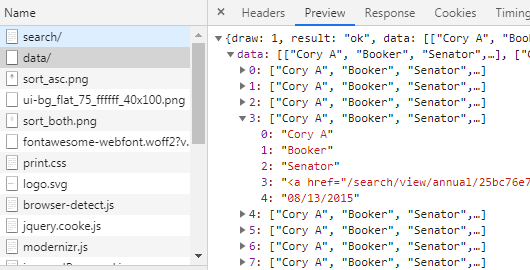

# Capturing Electronic Filings
Disclosures may be submitted electronically or by paper, resulting in dramatically different displays. Due to the systematic formatting of electronic filings, we will look to build a local data cache for our personal use.

<table>
    <tr>
        <td>Electronic</td>
        <td>Paper Submission resulting in Image</td>
    </tr>
    <tr>
        <td></td>
        <td></td>
    </tr>
</table>

We will use a combination of [Requests](https://github.com/kennethreitz/requests) for downloading and [BeautifulSoup4]() for parsing documents. First we should explore the website and understand the network activity taking place.

## Manual Network Review
https://efdsearch.senate.gov/search/

<table style="max-width: 800px">
    <tr>
        <td></td>
        <td></td>
    </tr>
</table>

We can use Chrome's DevTools (Ctrl+Shirt+i) to review requests that occur when the `Search Reports` button is pressed. We are looking for POST requests that may contain the search results. Often times the data is returned embedded within the HTML (we will see this later with the eletronic filing details), but in this case we see there is a separate response.

<table style="max-width: 800px">
    <tr>
        <td width="45%">1. Reviewing Network Responses</td>
        <td>3. Copy Request</td>
    </tr>
    <tr>
        <td></td>
        <td rowspan="3"></td>
    </tr>
    <tr><td>2. Preview Reponse Data</td></tr>
    <tr><td></td></tr>
    <tr><td colspan="2">4. Replay Request and Response</td></tr>
    <tr><td colspan="2" style="text-align: center;"></td></tr>
</table>

## Python Request and Session
Let's try to duplicate our manual efforts above now that we know what we are looking for. Starting all the way back at agreeing to the prohibitions on obtaining and use of financial disclosure reports. When we use the Network tab with DevTools we can see what form data is sent along when a user checks the agreement box and is allowed to search.


We need to grab the form input elements to append to our post.
```html
    <form action="" method="POST" id="agreement_form">
        <div class="checkbox">
            <label>
                <input type="checkbox" id="agree_statement" value="1" name="prohibition_agreement" />
                I understand the prohibitions on obtaining and use of financial disclosure reports.
            </label>
        </div>
        <input type="hidden" name="csrfmiddlewaretoken" value="{TOKEN_WEB_FORM}">
    </form>
```

### Fetch the Access page, and parse the web tokens.
```python
from bs4 import BeautifulSoup
import requests

EFD_ENDPOINT_SEARCH = 'https://efdsearch.senate.gov/search/'

session = requests.Session()
response = session.get(EFD_ENDPOINT_SEARCH)

soup = BeautifulSoup(response.text, features='html.parser')
csrf_token = soup.find('input', {'name': 'csrfmiddlewaretoken'})

print(csrf_token)
```

```html
<input name="csrfmiddlewaretoken" type="hidden" value="{TOKEN_WEB_FORM}"/>
```

### Post the web token and agreement form
```python
EFD_ENDPOINT_ACCESS = 'https://efdsearch.senate.gov/search/home/'
headers = {
    'User-Agent': '{USER_AGENT_STRING}',
    'Origin': 'https://efdsearch.senate.gov',
    'Referer': 'https://efdsearch.senate.gov/search/home/'
}

payload = {
    'prohibition_agreement': 1,
    'csrfmiddlewaretoken': csrf_token['value']
}

session.headers.update(headers)
response = session.post(EFD_ENDPOINT_ACCESS, data=payload)
soup = BeautifulSoup(response.text, features='html.parser')

form_names = [i['name'] for i in soup.find('form').findAll('input')]
print(form_names)
```
```python
[
    'first_name', 'last_name',
    'filer_type', 'filer_type', 'filer_type',
    'report_type', 'report_type', 'report_type', 'report_type', 'report_type',
    'submitted_start_date', 'submitted_end_date',
    'csrfmiddlewaretoken'
]
```

We have made it to the search page with all the form elements. 


### Searching for document links
When we were monitoring network traffic, we saw a separate post for the data that we can mimic.

```python
EFD_ENDPOINT_DATA = 'https://efdsearch.senate.gov/search/report/data/'
form_data = {
    'start': 0,
    'length': 100,
    'report_types': '[7]',  # Annual Report
    'filter_types': '[1]',  # Senators
    'last_name': 'booker',
    'submitted_start_date': '01/01/2012 00:00:00'
}

cookies = session.cookies.get_dict()
session.headers.update({
    'Referer': 'https://efdsearch.senate.gov/search/',
    'X-CSRFToken': cookies['csrftoken'],
})
post_reponse = session.post(EFD_ENDPOINT_DATA, data=form_data)

import json
data = json.loads(post_reponse.text)

print (data)
```
```python
{
    'recordsTotal': 14,
    'result': 'ok',
    'recordsFiltered': 14,
    'data': [
        # First Name (Middle), Last Name (Suffix), Filer Type, Report Type, Date
        ['Cory A', 'Booker', 'Senator', '<a href="/search/view/annual/8796c940-0d0d-4579-83ce-edb3d373780c/" target="_blank">Annual Report for CY 2018</a>', '05/15/2019'],
        ['Cory A', 'Booker', 'Senator', '<a href="/search/view/annual/07cc0116-e3fe-4c59-b690-eea428b06391/" target="_blank">Annual Report for CY 2017</a>', '08/13/2018'],
        ['Cory A', 'Booker', 'Senator', '<a href="/search/view/annual/fe9962a4-8d3d-4643-bf6a-03030d0a9fba/" target="_blank">Annual Report for CY 2013</a>', '08/13/2014'],
        ['CORY A', 'BOOKER', 'Senator', '<a href="/search/view/paper/F812F020-B884-40FC-9F5F-767EBFD82B9C/" target="_blank">Annual Report (Amendment)</a>', '09/06/2013'],
        ['CORY A', 'BOOKER', 'Senator', '<a href="/search/view/paper/DF9409C9-EFD2-4A19-A001-7DD7720E1E23/" target="_blank">Annual Report (Amendment)</a>', '07/12/2013'],
        ['CORY A', 'BOOKER', 'Senator', '<a href="/search/view/paper/798AF060-743C-4004-B487-675722DB420A/" target="_blank">Annual Report</a>', '05/16/2013']
    ]
}
```

`/!\ Attention:` Interacting with websites in this manner requires great care. You need to consider the intentions of the website when accessing their data. If they planned for users to browser the site one page at a time, at a speed of approximately 1 second per page, then to need to respect those conditions. You are responsible for any undue burden placed on the endpoint.

You will also be without documentation of any kind when determining which cookies, headers, or data are required for successful responses.

### Up Next: Saving requests and responses. Rate limiting requests. Handling pagination. Finding new documents.
