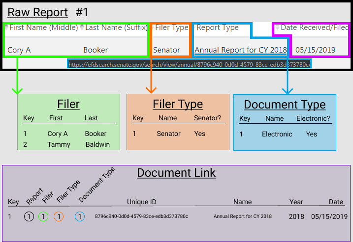

# Relational Document Link Storage

## Data Normalization
We won't just be adding these new document fields to the existing attributes and inserting them into the same table. Here we will work to reduce data duplication by reusing already known entities. For instance, we should have a reference to each Senator's name and won't need to keep storing the actual text values for first and last name.

### Entities
**Filer:** Who is the person that the document is filed for?

**Filer Type:**
What is the role of the person who is filing?

**Document Type:**
How was the document filed?

**Document Link:**
Connecting all the attributes to the report.
